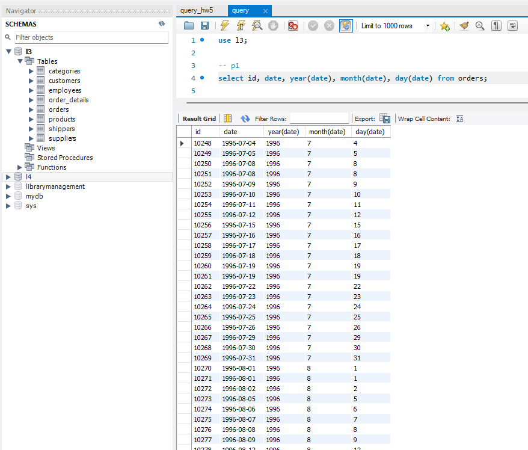
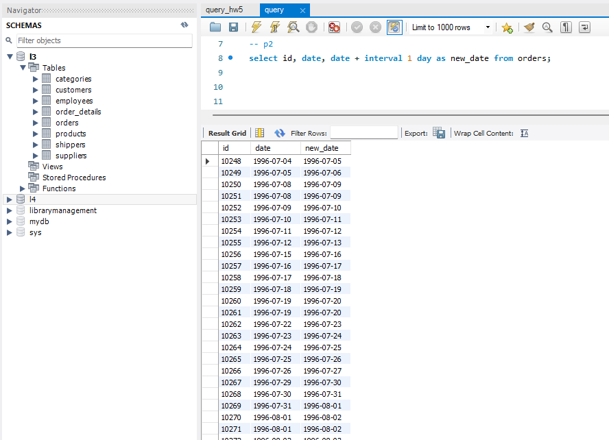
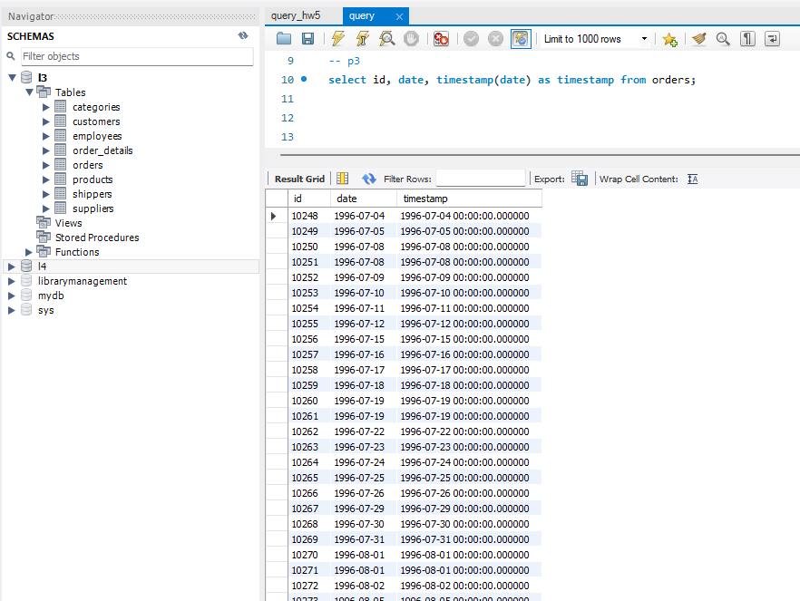
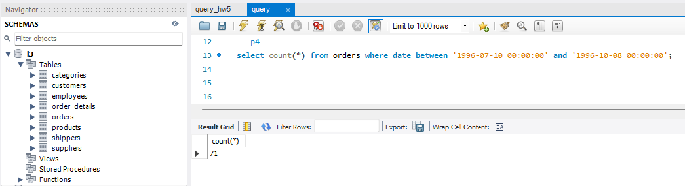
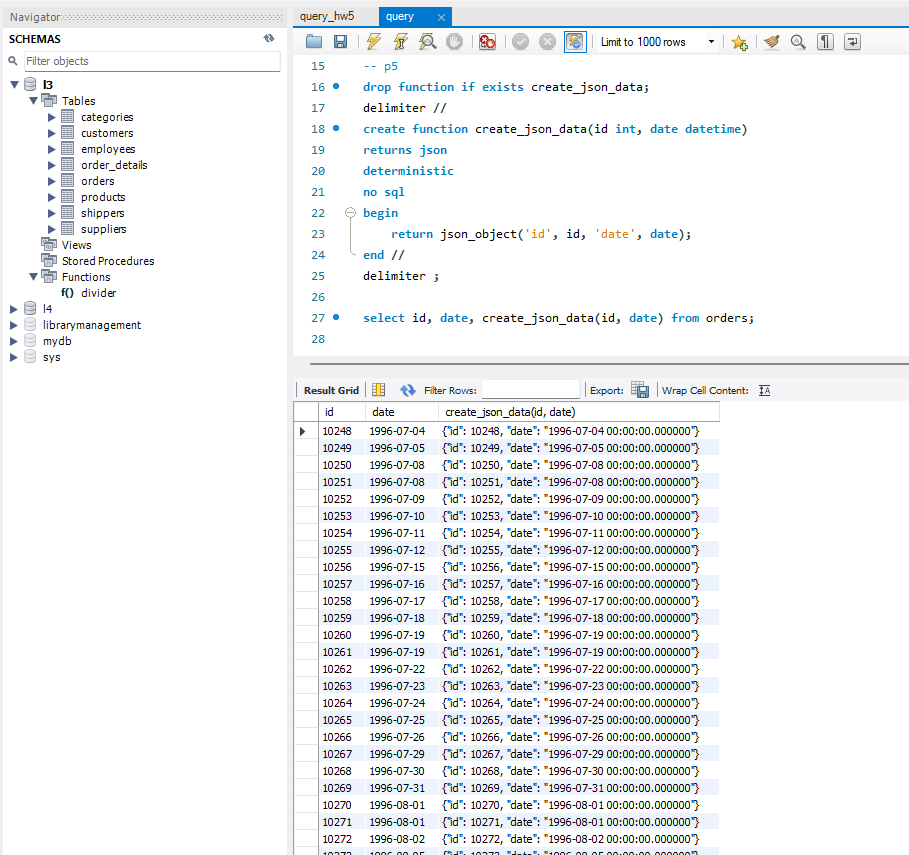

## Домашнє завдання до Теми 7. Додаткові вбудовані SQL функції. Робота з часом

### Виконання.

 1. Напишіть SQL-запит, який для таблиці `orders` з атрибута `date` витягує рік, місяць і число. Виведіть на екран їх у три окремі атрибути поряд з атрибутом `id` та оригінальним атрибутом `date` (всього вийде 5 атрибутів).

```sql
select id, date, year(date), month(date), day(date) from orders;
```


2. Напишіть SQL-запит, який для таблиці `orders` до атрибута `date` додає один день. На екран виведіть атрибут `id`, оригінальний атрибут `date` та результат додавання.

```sql
select id, date, date + interval 1 day as new_date from orders;
```


3. Напишіть SQL-запит, який для таблиці `orders` для атрибута `date` відображає кількість секунд з початку відліку (показує його значення timestamp). Для цього потрібно знайти та застосувати необхідну функцію. На екран виведіть атрибут `id`, оригінальний атрибут `date` та результат роботи функції.

```sql
select id, date, timestamp(date) as timestamp from orders;
```


4. Напишіть SQL-запит, який рахує, скільки таблиця `orders` містить рядків з атрибутом `date` у межах між `1996-07-10 00:00:00` та `1996-10-08 00:00:00`.

```sql
with temp_od as (select order_id, quantity from order_details where quantity>10)
select temp_od.order_id, avg(temp_od.quantity) from temp_od
group by temp_od.order_id;
```


5. Напишіть SQL-запит, який для таблиці `orders` виводить на екран атрибут `id`, атрибут `date` та JSON-об’єкт `{"id": <атрибут id рядка>, "date": <атрибут date рядка>}`. Для створення JSON-об’єкта використайте функцію.

```sql
drop function if exists create_json_data;
delimiter //
create function create_json_data(id int, date datetime)
returns json
deterministic
no sql
begin
    return json_object('id', id, 'date', date);
end //
delimiter ;

select id, date, create_json_data(id, date) from orders;
```
